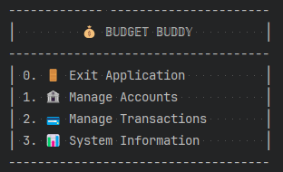
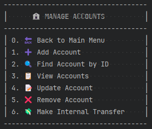
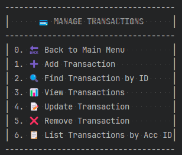
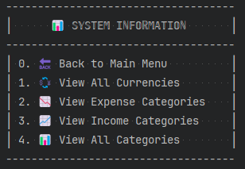
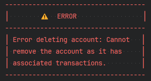

# 💰 BUDGET BUDDY

---

# 📚 Table of Contents

- [📋 Overview](#-overview)
- [🚀 Getting Started](#-getting-started)
- [💡 Features](#-features)
- [🛠 Installation](#-installation)
- [🎮 Usage](#-usage)
- [📬 Connect With Me](#-connect-with-me)

---

## 📋 Overview

>**Budget Buddy** is a simple console-based personal finance tracker built with a clean MVC architecture. 
It allows you to manage accounts, track transactions, and handle finances with ease, all through a user-friendly interface. 
The app offers essential features like account management, income/expense tracking, and internal transfers, 
with data stored in lightweight JSON files. 
No external dependencies are required, making it an ideal tool for personal finance management.


---

## 🚀 Getting Started

Welcome to **Budget Buddy**! This section outlines how to get your project up and running in no time. 🎉

Follow the steps below to set up the project on your local machine.

---

## 💡 Features


### 🏦 Account Lifecycle Management
- **🆕 Complete CRUD Operations**: Create, read, update, and delete accounts through a dedicated AccountController.
- **🛡️ Data Validation**: Prevents duplicate account names and ensures data integrity.
- **💼 Flexible Account Properties**: Each account maintains a balance, currency type, and unique identifier.
- **💾 Persistence Layer**: Accounts are stored in a structured data format using AccountDao implementation.

### 💸 Income & Expense Tracking
- **🏷️ Category-Based Transactions**: Organize finances with predefined income and expense categories.
- **🔒 Balance Protection**: Advanced validation prevents expenses that would result in negative balances.
- **⚡ Real-time Balance Updates**: Account balances are automatically updated with each transaction.
- **💱 Multi-currency Support**: Track finances across different currencies.

### 🔁 Internal Transfers
- **🔄 Account-to-Account Transfers**: Move funds between accounts with comprehensive validation.
- **✅ Transaction Integrity**: Ensures source has sufficient funds and prevents self-transfers.
- **📊 Automated Dual-Entry**: Each transfer creates appropriate records in both accounts.

### 🧾 Transaction Management
- **🔐 Immutable Transaction Records**: Maintains financial audit trail with immutable transactions.
- **🗑️ Safe Deletion Logic**: Transactions can only be removed if the resulting balance remains valid.
- **📜 Transaction History**: Comprehensive logging of all financial activities.
- **🔍 Account-Based Filtering**: View transactions history specific to individual accounts.

### 🧠 Intelligent Validation System
- **🧩 Layered Validation**: Business rules enforced at service layer with custom validation logic.
- **❗ Consistent Error Handling**: User-friendly error messages guide through proper usage.
- **🛑 Prevention of Invalid States**: System design prevents accounts from reaching invalid states.
- **🔗 Data Integrity Checks**: Validations ensure referential integrity between accounts and transactions.

### 💾 Persistence Framework
- **🗃️ Custom DAO Layer**: Data Access Objects provide separation between business logic and storage.
   - **📄 JSON Serialization**: Efficient data storage using JSON format.
   - **📁 File-based Database**: Lightweight storage solution without external database dependencies.
   - **🔄 Data Loading/Saving**: Automatic loading and saving of application state.

### 🎨 User-Friendly Interface
- **📋 Structured Menu System**: Intuitive navigation with MainMenu, AccountMenu, TransactionMenu, and InfoMenu.
- **⌨️ Interactive Command Processing**: Responsive input handling with immediate feedback.
- **👁️ Visual Clarity**: Clean output with easy navigation.
- **🧭 Guided Experience**: Step-by-step prompts for tasks.
---

## 🛠 Installation

Follow these simple steps to set up Budget Buddy on your machine:

1. **Clone the repository**:
   ```bash
   git clone https://github.com/MarynaHuz/BudgetBuddy.git
   ```

2. **Navigate to the project directory**:
   ```bash
   cd BudgetBuddy
   ```

3. **Build the project with Maven**:
   ```bash
   mvn clean install
   ```

4. **Verify Java requirements**:
    - Ensure you have Java 21 installed:
    ```bash
    java -version
    ```
    - The application requires JDK 21 to run properly

That's it! 🎉 Your Budget Buddy is ready to help you manage your finances!


---

## 🎮 Usage

Dive into Budget Buddy's intuitive console interface and take control of your finances with these simple steps!

### 🚀 Starting the Application

To launch Budget Buddy:
1. Navigate to the project directory
2. Run the `BudgetBuddyApp` class which contains the main method:
   ```java
    java -jar target/BudgetBuddy-1.0-SNAPSHOT.jar
   ```

   Alternatively, directly run the class from your IDE by executing the main method in `BudgetBuddyApp.java`

### 🖥️ Display Issues

If you encounter display issues with special characters in the console interface (seeing ??? instead of proper characters), 
you can fix it by setting the correct character encoding:

**For Windows Command Prompt:**

Once launched, you'll be welcomed to your personal finance command center!

```chcp 65001```

This command sets the console to use UTF-8 encoding, 
which properly displays all special characters used in the application interface.

After setting the encoding, run the application again:

```java -jar target/BudgetBuddy-1.0-SNAPSHOT.jar```


### 🏠 Welcome to the Main Hub


Launch into your financial journey through our central command center. From here, you can:
- 🏦 Jump to Account Management
- 💸 Handle Transactions
- 📊 Access Category & Currency Information
- 🚪 Exit when you're done

### 💰 Account Command Center


Your accounts are the foundation of your financial empire:
- ✨ Create fresh accounts in multiple currencies
- 👁️ Get a bird's-eye view of all your finances
- 🔄 Update account details on the fly
- 🗑️ Remove accounts with smart validation protection
- 💸 Make internal transfers between your accounts

### 💸 Money Movement Headquarters


Every dollar has a story - tell yours with ease:
- 📈 Record income across categories like Salary, Investments, or Gifts
- 📉 Track expenses from Groceries to Entertainment
- ↔️ Seamlessly transfer funds between accounts
- 🗑️ Clean up with transaction deletion when needed
- 🔍 Zoom in on transactions for specific accounts

### 📊 Financial Intelligence Center


Get quick access to essential reference information:
- 📋 Browse available expense categories
- 💹 Review income category options
- 💱 Check supported currency types
- 🧭 Access this information anytime during account or transaction creation

This handy reference hub ensures you always know which categories and currencies are available 
when setting up accounts or recording transactions - no guesswork required!

### ⚠️ Error Handling


Budget Buddy provides clear guidance when things don't go as planned:
- 🛑 **Helpful Error Messages**: Specific instructions on what went wrong and how to fix it
- 🚫 **Preventive Validation**: Stops invalid actions before they happen (like overdrafts)
- 🔙 **Quick Recovery**: Simple prompts to try again or return to menu after any error

The app ensures you're never left wondering what happened or how to proceed!

### 🚀 60-Second Quickstart

**Mission: Create your first account and record a transaction in under a minute!**

1. Select "Account Menu" from the main hub
2. Choose "Create New Account"
3. Name your financial fortress and set its currency
4. Head back to the main menu and select "Transaction Menu"
5. Pick "Add Income" to celebrate your first deposit
6. Follow the friendly prompts to complete your mission

All your financial data is automatically saved in the background - no manual backups needed! Your financial command center will be waiting for you exactly as you left it.

_Ready to take control of your finances? Budget Buddy is standing by, commander!_ 💪


---

## 📬 Connect With Me

Found a bug? Have a feature request? Just want to say hello? I'd love to hear from you!

- 📧 **Email**: maryna.huz.dev@gmail.com
- 🔗 **GitHub**: [Maryna Huz](https://github.com/MarynaHuz)
- 👔 **LinkedIn**: [Maryna Huz](https://www.linkedin.com/in/maryna-huz/)

---

_✨ Happy Coding! ✨_